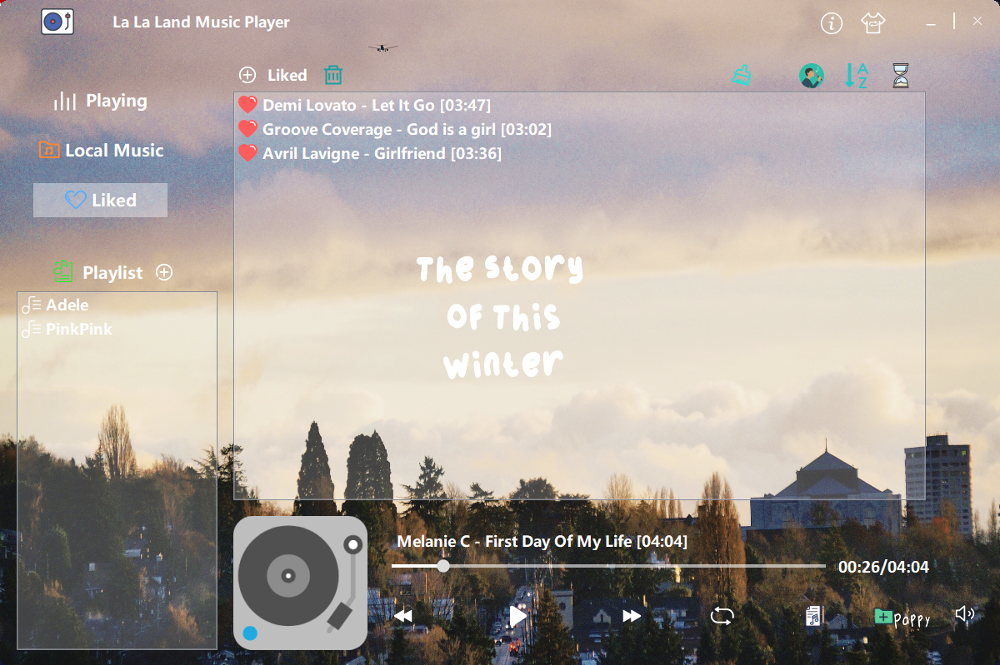

# 🎵 La La Land

A lightweight local music player built with C++ and Qt5, supporting local music playback, playlist management, lyrics display, and custom backgrounds. Includes system tray controls, with music and playlist data stored using SQLite. Application settings are managed through .ini configuration files for a smooth experience.
  

  
## 📌 Features
- Local music playback
- Playlist management
- Customizable backgrounds
- System tray controls
- SQLite database integration
- .ini file configuration for persistent settings

## 🔋 Tech Stack
- C++
- Qt5
- SQLite

## 🚗 Getting Started
- Clone the repository
- Build the project using Qt Creator
- Hit the green magic button, and start using the player

## 🛞 Build Information
This project was built using Qt 5.9.8 with the MinGW 5.3.0 32-bit compiler suite. 
Please ensure that you have the correct version of Qt and the MinGW compiler installed in order to successfully compile the project.
